Development with Docker
-----------------------

## 1. Clone project https://github.com/haos616/docker-workshop-2
```bash
$ git clone git@github.com:haos616/docker-workshop-2.git
```

## 2. Build django image
> Run docker-compose in `docker` folder
```bash
$ docker-compose build
```
or
 ```bash
$ docker-compose build django
```

Building django image:
```
Building django
Step 1 : FROM python:3.5.3
 ---> b0d7fc8a7ace
Step 2 : ENV PYTHONUNBUFFERED 1
 ---> Using cache
 ---> abf0231e016a
Step 3 : RUN pip install django==1.10.5
 ---> Using cache
 ---> ce753b91ebec
Successfully built ce753b91ebec
```

## 3. Create django project use Docker
### Run django-admin startproject
```bash
$ docker-compose run django django-admin startproject ws2 /code
```

> Project created but have permission problem. Files and directory created root user
```bash
$ ls -la api
total 16
drwxr-xr-x 3 haos haos 4096 Feb 23 01:54 .
drwxr-xr-x 6 haos haos 4096 Feb 23 01:54 ..
-rw-r--r-- 1 haos haos    0 Feb 23 01:51 .gitkeep
-rwxr-xr-x 1 root root  801 Feb 23 01:54 manage.py
drwxr-xr-x 2 root root 4096 Feb 23 01:54 ws2
```

### Remove project files and directory
```bash
$ docker-compose run django rm -rf /code/
rm: cannot remove ‘/code/’: Device or resource busy
```
> Files and directory removed but not remove folder /code.
> Can't remove mounted folder

### Get UID and GUI
```bash
$ id
uid=1000(haos) gid=1000(haos)
```

### Add gosu in django image
[Necessary changes](https://github.com/haos616/docker-workshop-2/commit/409d044b1fef399eb08f4b7ec95c839c8e887a7c)

### Set UID to LOCAL_USER_ID in docker/.env
```
LOCAL_USER_ID=1000
```

### Rebuild django image
```bash
$ docker-compose build django
```

### Rebuilding django image
```
Building django
Step 1 : FROM python:3.5.3
 ---> b0d7fc8a7ace
Step 2 : ENV PYTHONUNBUFFERED 1
 ---> Using cache
 ---> abf0231e016a
Step 3 : RUN apt-get update     && apt-get -y --no-install-recommends install ca-certificates curl     && gpg --keyserver ha.pool.sks-keyservers.net --recv-keys B42F6819007F00F88E364FD4036A9C25BF357DD4     && curl -o /usr/local/bin/gosu -SL "https://github.com/tianon/gosu/releases/download/1.4/gosu-$(dpkg --print-architecture)"     && curl -o /usr/local/bin/gosu.asc -SL "https://github.com/tianon/gosu/releases/download/1.4/gosu-$(dpkg --print-architecture).asc"     && gpg --verify /usr/local/bin/gosu.asc     && rm /usr/local/bin/gosu.asc     && chmod +x /usr/local/bin/gosu
 ---> Using cache
 ---> 47d2762955b1
Step 4 : ADD ./docker-entrypoint.sh /scripts/docker-entrypoint.sh
 ---> Using cache
 ---> ec771070b4b1
Step 5 : RUN chmod +x /scripts/docker-entrypoint.sh
 ---> Running in 08472183f29d
 ---> 9dacedf98b0a
Removing intermediate container 08472183f29d
Step 6 : RUN pip install django==1.10.5
 ---> Running in a8bde17aa9ab
Collecting django==1.10.5
  Downloading Django-1.10.5-py2.py3-none-any.whl (6.8MB)
Installing collected packages: django
Successfully installed django-1.10.5
 ---> e14a511745a4
Removing intermediate container a8bde17aa9ab
Step 7 : WORKDIR /code
 ---> Running in 450b4a409c56
 ---> fe2c757f71c7
Removing intermediate container 450b4a409c56
Step 8 : ENTRYPOINT /scripts/docker-entrypoint.sh
 ---> Running in 081d5e5809c8
 ---> 05e908885f39
Removing intermediate container 081d5e5809c8
Successfully built 05e908885f39
```

### Run django-admin startproject
```bash
$ docker-compose run django django-admin startproject ws2 /code
Starting with UID : 1000
```

## 4. Clean containers
### Get all containers
```bash
$ docker ps -a
CONTAINER ID        IMAGE                                       COMMAND                  CREATED             STATUS                      PORTS                      NAMES
c03d882e10e7        hub.example.com/ws2/django:dev              "/scripts/docker-entr"   6 seconds ago       Exited (0) 4 seconds ago                               ws2_django_run_2
fbf817a74ef2        hub.example.com/ws2/django:dev              "/scripts/docker-entr"   52 seconds ago      Exited (0) 49 seconds ago                              ws2_django_run_1
```

### Remove containers created for run
```bash
$ docker-compose down
Removing ws2_django_run_2 ... done
Removing ws2_django_run_1 ... done
Removing network ws2_default
```
or
```bash
$ docker rm ws2_django_run_1
ws2_django_run_1
$ docker rm ws2_django_run_2
ws2_django_run_2
```
> For `run` need using `--rm` for remove container after running

## 5. Run django
### Add command and port for django service
[Necessary changes](https://github.com/haos616/docker-workshop-2/commit/ffe6cfd7c7e4235b680725bdb4179b1776473250)

### Run docker-compose
```bash
$ docker-compose up
Creating network "ws2_default" with the default driver
Creating ws2_django_1
Attaching to ws2_django_1
django_1  | Starting with UID : 1000
django_1  | Performing system checks...
django_1  | 
django_1  | System check identified no issues (0 silenced).
django_1  | 
django_1  | You have 13 unapplied migration(s). Your project may not work properly until you apply the migrations for app(s): admin, auth, contenttypes, sessions.
django_1  | Run 'python manage.py migrate' to apply them.
django_1  | February 23, 2017 - 01:33:02
django_1  | Django version 1.10.5, using settings 'ws2.settings'
django_1  | Starting development server at http://0.0.0.0:8000/
django_1  | Quit the server with CONTROL-C.
```

### Check admin url
> Go to `http://127.0.0.1:8000/admin/`

## 6. Add postgres service
### Add settings and files for postgres service
[Necessary changes](https://github.com/haos616/docker-workshop-2/commit/4910b1e1e70fbc9d286d9665b83823ceb7168e42)

### Rebuild django and postgres images
```bash
$ docker-compose build
Building postgres
Step 1 : FROM postgres:9.6.2
 ---> ecd991538a0f
Step 2 : ADD backup.sh /usr/local/bin/backup
 ---> Using cache
 ---> 53cec657dcdc
Step 3 : ADD restore.sh /usr/local/bin/restore
 ---> Using cache
 ---> 7d5807fe38dc
Step 4 : ADD list-backups.sh /usr/local/bin/list-backups
 ---> Using cache
 ---> 1c51f0b77723
Step 5 : RUN chmod +x /usr/local/bin/restore     && chmod +x /usr/local/bin/list-backups     && chmod +x /usr/local/bin/backup
 ---> Using cache
 ---> 60af1d95ad45
Step 6 : ADD ./docker-entrypoint.sh /scripts/docker-entrypoint.sh
 ---> Using cache
 ---> 5d39b88177b1
Step 7 : VOLUME /backups
 ---> Using cache
 ---> ac21bdc08fd2
Successfully built ac21bdc08fd2
Building django
Step 1 : FROM python:3.5.3
 ---> b0d7fc8a7ace
Step 2 : ENV PYTHONUNBUFFERED 1
 ---> Using cache
 ---> abf0231e016a
Step 3 : RUN apt-get update     && apt-get -y --no-install-recommends install ca-certificates curl     && gpg --keyserver ha.pool.sks-keyservers.net --recv-keys B42F6819007F00F88E364FD4036A9C25BF357DD4     && curl -o /usr/local/bin/gosu -SL "https://github.com/tianon/gosu/releases/download/1.4/gosu-$(dpkg --print-architecture)"     && curl -o /usr/local/bin/gosu.asc -SL "https://github.com/tianon/gosu/releases/download/1.4/gosu-$(dpkg --print-architecture).asc"     && gpg --verify /usr/local/bin/gosu.asc     && rm /usr/local/bin/gosu.asc     && chmod +x /usr/local/bin/gosu
 ---> Using cache
 ---> 47d2762955b1
Step 4 : ADD ./docker/images/django/docker-entrypoint.sh /scripts/docker-entrypoint.sh
 ---> 8e52ce917a82
Removing intermediate container ebe66a8eed42
Step 5 : RUN chmod +x /scripts/docker-entrypoint.sh
 ---> Running in 022e70944ec6
 ---> 0b48164ee10e
Removing intermediate container 022e70944ec6
Step 6 : RUN pip install django==1.10.5
 ---> Running in 5584c07ea4e5
Collecting django==1.10.5
  Downloading Django-1.10.5-py2.py3-none-any.whl (6.8MB)
Installing collected packages: django
Successfully installed django-1.10.5
 ---> b5b03d332cf3
Removing intermediate container 5584c07ea4e5
Step 7 : RUN mkdir /code
 ---> Running in ca4c062f4586
 ---> e73e7358befe
Removing intermediate container ca4c062f4586
Step 8 : ADD ./api/requirements /code/requirements
 ---> ea42aa8e191f
Removing intermediate container 849f816790cf
Step 9 : RUN pip install -r /code/requirements/dev.txt
 ---> Running in 19d31f76a817
Requirement already satisfied: django<1.11,>=1.10 in /usr/local/lib/python3.5/site-packages (from -r /code/requirements/base.txt (line 1))
Collecting django-environ==0.4.1 (from -r /code/requirements/base.txt (line 2))
  Downloading django_environ-0.4.1-py2.py3-none-any.whl
Collecting psycopg2==2.6.2 (from -r /code/requirements/base.txt (line 3))
  Downloading psycopg2-2.6.2.tar.gz (376kB)
Collecting six (from django-environ==0.4.1->-r /code/requirements/base.txt (line 2))
  Downloading six-1.10.0-py2.py3-none-any.whl
Installing collected packages: six, django-environ, psycopg2
  Running setup.py install for psycopg2: started
    Running setup.py install for psycopg2: finished with status 'done'
Successfully installed django-environ-0.4.1 psycopg2-2.6.2 six-1.10.0
 ---> f521cdd0660f
Removing intermediate container 19d31f76a817
Step 10 : WORKDIR /code
 ---> Running in 0f0848bcafb6
 ---> b3017182eadc
Removing intermediate container 0f0848bcafb6
Step 11 : ENTRYPOINT /scripts/docker-entrypoint.sh
 ---> Running in b9043166da9d
 ---> 2d6fbb4e7495
Removing intermediate container b9043166da9d
Successfully built 2d6fbb4e7495
```

### Run docker-compose
```bash
$ docker-compose up
Creating network "ws2_default" with the default driver
Creating volume "ws2_postgres_data" with default driver
Creating ws2_postgres_1
Creating ws2_django_1
Attaching to ws2_postgres_1, ws2_django_1
postgres_1  | The files belonging to this database system will be owned by user "postgres".
postgres_1  | This user must also own the server process.
postgres_1  | 
postgres_1  | The database cluster will be initialized with locale "en_US.utf8".
postgres_1  | The default database encoding has accordingly been set to "UTF8".
postgres_1  | The default text search configuration will be set to "english".
postgres_1  | 
django_1    | Starting with UID : 1000
postgres_1  | Data page checksums are disabled.
postgres_1  | 
postgres_1  | fixing permissions on existing directory /var/lib/postgresql/data ... ok
postgres_1  | creating subdirectories ... ok
postgres_1  | selecting default max_connections ... 100
postgres_1  | selecting default shared_buffers ... 128MB
postgres_1  | selecting dynamic shared memory implementation ... posix
postgres_1  | creating configuration files ... ok
postgres_1  | running bootstrap script ... ok
django_1    | /usr/local/lib/python3.5/site-packages/environ/environ.py:608: UserWarning: /code/ws2/.env doesn't exist - if you're not configuring your environment separately, create one.
django_1    |   "environment separately, create one." % env_file)
postgres_1  | performing post-bootstrap initialization ... ok
django_1    | /usr/local/lib/python3.5/site-packages/environ/environ.py:608: UserWarning: /code/ws2/.env doesn't exist - if you're not configuring your environment separately, create one.
django_1    |   "environment separately, create one." % env_file)
django_1    | Performing system checks...
django_1    | 
django_1    | System check identified no issues (0 silenced).
django_1    | Unhandled exception in thread started by <function check_errors.<locals>.wrapper at 0x7f4679db0840>
django_1    | Traceback (most recent call last):
django_1    |   File "/usr/local/lib/python3.5/site-packages/django/db/backends/base/base.py", line 199, in ensure_connection
django_1    |     self.connect()
django_1    |   File "/usr/local/lib/python3.5/site-packages/django/db/backends/base/base.py", line 171, in connect
django_1    |     self.connection = self.get_new_connection(conn_params)
django_1    |   File "/usr/local/lib/python3.5/site-packages/django/db/backends/postgresql/base.py", line 176, in get_new_connection
django_1    |     connection = Database.connect(**conn_params)
django_1    |   File "/usr/local/lib/python3.5/site-packages/psycopg2/__init__.py", line 164, in connect
django_1    |     conn = _connect(dsn, connection_factory=connection_factory, async=async)
django_1    | psycopg2.OperationalError: could not connect to server: Connection refused
django_1    | 	Is the server running on host "postgres" (172.25.0.2) and accepting
django_1    | 	TCP/IP connections on port 5432?
```
> django container run earlier than been created a database

### Add wait created postgres database
[Necessary changes](https://github.com/haos616/docker-workshop-2/commit/923cc60e3751cca95d552a5b17a29b20e044e105)

### Rebuild django image
```bash
$ docker-compose build django
```

### Remove containers, networks, images, and volumes
```bash
$ docker-compose down -v
Removing ws2_django_1 ... done
Removing ws2_postgres_1 ... done
Removing network ws2_default
Removing volume ws2_postgres_data
```

### Run docker-compose
```bash
$ docker-compose down -v
Removing ws2_django_1 ... done
Removing ws2_postgres_1 ... done
Removing network ws2_default
Removing volume ws2_postgres_data
haos@Dark:~/myprojects/docker-ws2/docker$ docker-compose up
Creating network "ws2_default" with the default driver
Creating volume "ws2_postgres_data" with default driver
Creating ws2_postgres_1
Creating ws2_django_1
Attaching to ws2_postgres_1, ws2_django_1
django_1    | Starting with UID : 1000
postgres_1  | The files belonging to this database system will be owned by user "postgres".
postgres_1  | This user must also own the server process.
postgres_1  | 
postgres_1  | The database cluster will be initialized with locale "en_US.utf8".
postgres_1  | The default database encoding has accordingly been set to "UTF8".
postgres_1  | The default text search configuration will be set to "english".
postgres_1  | 
postgres_1  | Data page checksums are disabled.
postgres_1  | 
postgres_1  | fixing permissions on existing directory /var/lib/postgresql/data ... ok
postgres_1  | creating subdirectories ... ok
postgres_1  | selecting default max_connections ... 100
postgres_1  | selecting default shared_buffers ... 128MB
postgres_1  | selecting dynamic shared memory implementation ... posix
postgres_1  | creating configuration files ... ok
django_1    | Postgres is unavailable - sleeping
postgres_1  | running bootstrap script ... ok
postgres_1  | performing post-bootstrap initialization ... ok
django_1    | /usr/local/lib/python3.5/site-packages/environ/environ.py:608: UserWarning: /code/ws2/.env doesn't exist - if you're not configuring your environment separately, create one.
django_1    |   "environment separately, create one." % env_file)
django_1    | Postgres is unavailable - sleeping
django_1    | /usr/local/lib/python3.5/site-packages/environ/environ.py:608: UserWarning: /code/ws2/.env doesn't exist - if you're not configuring your environment separately, create one.
django_1    |   "environment separately, create one." % env_file)
django_1    | Postgres is unavailable - sleeping
postgres_1  | syncing data to disk ... ok
postgres_1  | 
postgres_1  | Success. You can now start the database server using:
postgres_1  | 
postgres_1  |     pg_ctl -D /var/lib/postgresql/data -l logfile start
postgres_1  | 
postgres_1  | 
postgres_1  | WARNING: enabling "trust" authentication for local connections
postgres_1  | You can change this by editing pg_hba.conf or using the option -A, or
postgres_1  | --auth-local and --auth-host, the next time you run initdb.
postgres_1  | waiting for server to start....LOG:  database system was shut down at 2017-02-23 22:09:21 UTC
postgres_1  | LOG:  MultiXact member wraparound protections are now enabled
postgres_1  | LOG:  database system is ready to accept connections
postgres_1  | LOG:  autovacuum launcher started
django_1    | /usr/local/lib/python3.5/site-packages/environ/environ.py:608: UserWarning: /code/ws2/.env doesn't exist - if you're not configuring your environment separately, create one.
django_1    |   "environment separately, create one." % env_file)
django_1    | Postgres is unavailable - sleeping
postgres_1  |  done
postgres_1  | server started
django_1    | /usr/local/lib/python3.5/site-packages/environ/environ.py:608: UserWarning: /code/ws2/.env doesn't exist - if you're not configuring your environment separately, create one.
django_1    |   "environment separately, create one." % env_file)
django_1    | Postgres is unavailable - sleeping
django_1    | /usr/local/lib/python3.5/site-packages/environ/environ.py:608: UserWarning: /code/ws2/.env doesn't exist - if you're not configuring your environment separately, create one.
django_1    |   "environment separately, create one." % env_file)
postgres_1  | CREATE DATABASE
postgres_1  | 
postgres_1  | CREATE ROLE
postgres_1  | 
postgres_1  | 
postgres_1  | /usr/local/bin/docker-entrypoint.sh: ignoring /docker-entrypoint-initdb.d/*
postgres_1  | 
postgres_1  | LOG:  received fast shutdown request
postgres_1  | LOG:  aborting any active transactions
postgres_1  | LOG:  autovacuum launcher shutting down
postgres_1  | LOG:  shutting down
django_1    | Postgres is unavailable - sleeping
postgres_1  | waiting for server to shut down....LOG:  database system is shut down
postgres_1  |  done
postgres_1  | server stopped
postgres_1  | 
postgres_1  | PostgreSQL init process complete; ready for start up.
postgres_1  | 
postgres_1  | LOG:  database system was shut down at 2017-02-23 22:09:34 UTC
postgres_1  | LOG:  MultiXact member wraparound protections are now enabled
postgres_1  | LOG:  autovacuum launcher started
postgres_1  | LOG:  database system is ready to accept connections
django_1    | /usr/local/lib/python3.5/site-packages/environ/environ.py:608: UserWarning: /code/ws2/.env doesn't exist - if you're not configuring your environment separately, create one.
django_1    |   "environment separately, create one." % env_file)
django_1    | /usr/local/lib/python3.5/site-packages/environ/environ.py:608: UserWarning: /code/ws2/.env doesn't exist - if you're not configuring your environment separately, create one.
django_1    |   "environment separately, create one." % env_file)
django_1    | /usr/local/lib/python3.5/site-packages/environ/environ.py:608: UserWarning: /code/ws2/.env doesn't exist - if you're not configuring your environment separately, create one.
django_1    |   "environment separately, create one." % env_file)
django_1    | Performing system checks...
django_1    | 
django_1    | System check identified no issues (0 silenced).
django_1    | 
django_1    | You have 13 unapplied migration(s). Your project may not work properly until you apply the migrations for app(s): admin, auth, contenttypes, sessions.
django_1    | Run 'python manage.py migrate' to apply them.
django_1    | February 23, 2017 - 22:09:37
django_1    | Django version 1.10.5, using settings 'ws2.settings'
django_1    | Starting development server at http://0.0.0.0:8000/
django_1    | Quit the server with CONTROL-C.
```
> Need run `python manage.py migrate`

### Run migrate
```bash
$ docker-compose run --rm django python manage.py migrate
Starting ws2_postgres_1
Starting with UID : 1000
Postgres is unavailable - sleeping
/usr/local/lib/python3.5/site-packages/environ/environ.py:608: UserWarning: /code/ws2/.env doesn't exist - if you're not configuring your environment separately, create one.
  "environment separately, create one." % env_file)
Postgres is unavailable - sleeping
/usr/local/lib/python3.5/site-packages/environ/environ.py:608: UserWarning: /code/ws2/.env doesn't exist - if you're not configuring your environment separately, create one.
  "environment separately, create one." % env_file)
Postgres is unavailable - sleeping
/usr/local/lib/python3.5/site-packages/environ/environ.py:608: UserWarning: /code/ws2/.env doesn't exist - if you're not configuring your environment separately, create one.
  "environment separately, create one." % env_file)
Postgres is unavailable - sleeping
/usr/local/lib/python3.5/site-packages/environ/environ.py:608: UserWarning: /code/ws2/.env doesn't exist - if you're not configuring your environment separately, create one.
  "environment separately, create one." % env_file)
Postgres is unavailable - sleeping
/usr/local/lib/python3.5/site-packages/environ/environ.py:608: UserWarning: /code/ws2/.env doesn't exist - if you're not configuring your environment separately, create one.
  "environment separately, create one." % env_file)
Postgres is unavailable - sleeping
/usr/local/lib/python3.5/site-packages/environ/environ.py:608: UserWarning: /code/ws2/.env doesn't exist - if you're not configuring your environment separately, create one.
  "environment separately, create one." % env_file)
Postgres is unavailable - sleeping
/usr/local/lib/python3.5/site-packages/environ/environ.py:608: UserWarning: /code/ws2/.env doesn't exist - if you're not configuring your environment separately, create one.
  "environment separately, create one." % env_file)
/usr/local/lib/python3.5/site-packages/environ/environ.py:608: UserWarning: /code/ws2/.env doesn't exist - if you're not configuring your environment separately, create one.
  "environment separately, create one." % env_file)
Operations to perform:
  Apply all migrations: admin, auth, contenttypes, sessions
Running migrations:
  Applying contenttypes.0001_initial... OK
  Applying auth.0001_initial... OK
  Applying admin.0001_initial... OK
  Applying admin.0002_logentry_remove_auto_add... OK
  Applying contenttypes.0002_remove_content_type_name... OK
  Applying auth.0002_alter_permission_name_max_length... OK
  Applying auth.0003_alter_user_email_max_length... OK
  Applying auth.0004_alter_user_username_opts... OK
  Applying auth.0005_alter_user_last_login_null... OK
  Applying auth.0006_require_contenttypes_0002... OK
  Applying auth.0007_alter_validators_add_error_messages... OK
  Applying auth.0008_alter_user_username_max_length... OK
  Applying sessions.0001_initial... OK
```

### Add django migrate in docker-entrypoint.sh
[Necessary changes](https://github.com/haos616/docker-workshop-2/commit/25af31e66c811dbafe302d87bc208c3d64ee7d65)

### Rebuild django image
```bash
$ docker-compose build django
```

### Remove containers, networks, images, and volumes
```bash
$ docker-compose down -v
Removing ws2_django_1 ... done
Removing ws2_postgres_1 ... done
Removing network ws2_default
Removing volume ws2_postgres_data
```

### Run docker-compose
```bash
$ docker-compose up
Creating volume "ws2_postgres_data" with default driver
Creating ws2_postgres_1
Creating ws2_django_1
Attaching to ws2_postgres_1, ws2_django_1
postgres_1  | The files belonging to this database system will be owned by user "postgres".
postgres_1  | This user must also own the server process.
postgres_1  | 
django_1    | Starting with UID : 1000
postgres_1  | The database cluster will be initialized with locale "en_US.utf8".
postgres_1  | The default database encoding has accordingly been set to "UTF8".
postgres_1  | The default text search configuration will be set to "english".
postgres_1  | 
postgres_1  | Data page checksums are disabled.
postgres_1  | 
postgres_1  | fixing permissions on existing directory /var/lib/postgresql/data ... ok
postgres_1  | creating subdirectories ... ok
postgres_1  | selecting default max_connections ... 100
postgres_1  | selecting default shared_buffers ... 128MB
postgres_1  | selecting dynamic shared memory implementation ... posix
postgres_1  | creating configuration files ... ok
django_1    | Postgres is unavailable - sleeping
postgres_1  | running bootstrap script ... ok
postgres_1  | performing post-bootstrap initialization ... ok
django_1    | /usr/local/lib/python3.5/site-packages/environ/environ.py:608: UserWarning: /code/ws2/.env doesn't exist - if you're not configuring your environment separately, create one.
django_1    |   "environment separately, create one." % env_file)
django_1    | Postgres is unavailable - sleeping
django_1    | /usr/local/lib/python3.5/site-packages/environ/environ.py:608: UserWarning: /code/ws2/.env doesn't exist - if you're not configuring your environment separately, create one.
django_1    |   "environment separately, create one." % env_file)
django_1    | Postgres is unavailable - sleeping
django_1    | /usr/local/lib/python3.5/site-packages/environ/environ.py:608: UserWarning: /code/ws2/.env doesn't exist - if you're not configuring your environment separately, create one.
django_1    |   "environment separately, create one." % env_file)
django_1    | Postgres is unavailable - sleeping
django_1    | /usr/local/lib/python3.5/site-packages/environ/environ.py:608: UserWarning: /code/ws2/.env doesn't exist - if you're not configuring your environment separately, create one.
django_1    |   "environment separately, create one." % env_file)
django_1    | Postgres is unavailable - sleeping
django_1    | /usr/local/lib/python3.5/site-packages/environ/environ.py:608: UserWarning: /code/ws2/.env doesn't exist - if you're not configuring your environment separately, create one.
django_1    |   "environment separately, create one." % env_file)
django_1    | Postgres is unavailable - sleeping
django_1    | /usr/local/lib/python3.5/site-packages/environ/environ.py:608: UserWarning: /code/ws2/.env doesn't exist - if you're not configuring your environment separately, create one.
django_1    |   "environment separately, create one." % env_file)
postgres_1  | syncing data to disk ... ok
postgres_1  | 
postgres_1  | Success. You can now start the database server using:
postgres_1  | 
postgres_1  | 
postgres_1  | WARNING: enabling "trust" authentication for local connections
postgres_1  | You can change this by editing pg_hba.conf or using the option -A, or
postgres_1  | --auth-local and --auth-host, the next time you run initdb.
postgres_1  |     pg_ctl -D /var/lib/postgresql/data -l logfile start
postgres_1  | 
django_1    | Postgres is unavailable - sleeping
postgres_1  | waiting for server to start....LOG:  database system was shut down at 2017-02-23 22:21:57 UTC
postgres_1  | LOG:  MultiXact member wraparound protections are now enabled
postgres_1  | LOG:  database system is ready to accept connections
postgres_1  | LOG:  autovacuum launcher started
postgres_1  |  done
postgres_1  | server started
django_1    | /usr/local/lib/python3.5/site-packages/environ/environ.py:608: UserWarning: /code/ws2/.env doesn't exist - if you're not configuring your environment separately, create one.
django_1    |   "environment separately, create one." % env_file)
django_1    | Postgres is unavailable - sleeping
django_1    | /usr/local/lib/python3.5/site-packages/environ/environ.py:608: UserWarning: /code/ws2/.env doesn't exist - if you're not configuring your environment separately, create one.
django_1    |   "environment separately, create one." % env_file)
django_1    | Postgres is unavailable - sleeping
postgres_1  | CREATE DATABASE
postgres_1  | 
postgres_1  | CREATE ROLE
postgres_1  | 
postgres_1  | 
postgres_1  | /usr/local/bin/docker-entrypoint.sh: ignoring /docker-entrypoint-initdb.d/*
postgres_1  | 
postgres_1  | LOG:  received fast shutdown request
postgres_1  | LOG:  aborting any active transactions
postgres_1  | waiting for server to shut down...LOG:  autovacuum launcher shutting down
postgres_1  | .LOG:  shutting down
postgres_1  | LOG:  database system is shut down
django_1    | /usr/local/lib/python3.5/site-packages/environ/environ.py:608: UserWarning: /code/ws2/.env doesn't exist - if you're not configuring your environment separately, create one.
django_1    |   "environment separately, create one." % env_file)
django_1    | Postgres is unavailable - sleeping
postgres_1  |  done
postgres_1  | server stopped
postgres_1  | 
postgres_1  | PostgreSQL init process complete; ready for start up.
postgres_1  | 
postgres_1  | LOG:  database system was shut down at 2017-02-23 22:22:10 UTC
postgres_1  | LOG:  MultiXact member wraparound protections are now enabled
postgres_1  | LOG:  autovacuum launcher started
postgres_1  | LOG:  database system is ready to accept connections
django_1    | /usr/local/lib/python3.5/site-packages/environ/environ.py:608: UserWarning: /code/ws2/.env doesn't exist - if you're not configuring your environment separately, create one.
django_1    |   "environment separately, create one." % env_file)
django_1    | /usr/local/lib/python3.5/site-packages/environ/environ.py:608: UserWarning: /code/ws2/.env doesn't exist - if you're not configuring your environment separately, create one.
django_1    |   "environment separately, create one." % env_file)
django_1    | Operations to perform:
django_1    |   Apply all migrations: admin, auth, contenttypes, sessions
django_1    | Running migrations:
django_1    |   Applying contenttypes.0001_initial... OK
django_1    |   Applying auth.0001_initial... OK
django_1    |   Applying admin.0001_initial... OK
django_1    |   Applying admin.0002_logentry_remove_auto_add... OK
django_1    |   Applying contenttypes.0002_remove_content_type_name... OK
django_1    |   Applying auth.0002_alter_permission_name_max_length... OK
django_1    |   Applying auth.0003_alter_user_email_max_length... OK
django_1    |   Applying auth.0004_alter_user_username_opts... OK
django_1    |   Applying auth.0005_alter_user_last_login_null... OK
django_1    |   Applying auth.0006_require_contenttypes_0002... OK
django_1    |   Applying auth.0007_alter_validators_add_error_messages... OK
django_1    |   Applying auth.0008_alter_user_username_max_length... OK
django_1    |   Applying sessions.0001_initial... OK
django_1    | /usr/local/lib/python3.5/site-packages/environ/environ.py:608: UserWarning: /code/ws2/.env doesn't exist - if you're not configuring your environment separately, create one.
django_1    |   "environment separately, create one." % env_file)
django_1    | /usr/local/lib/python3.5/site-packages/environ/environ.py:608: UserWarning: /code/ws2/.env doesn't exist - if you're not configuring your environment separately, create one.
django_1    |   "environment separately, create one." % env_file)
django_1    | Performing system checks...
django_1    | 
django_1    | System check identified no issues (0 silenced).
django_1    | February 23, 2017 - 22:22:15
django_1    | Django version 1.10.5, using settings 'ws2.settings'
django_1    | Starting development server at http://0.0.0.0:8000/
django_1    | Quit the server with CONTROL-C.
```

### Create superuser
```bash
$ docker-compose run --rm django python manage.py createsuperuser
Starting ws2_postgres_1
Starting with UID : 1000
Postgres is unavailable - sleeping
/usr/local/lib/python3.5/site-packages/environ/environ.py:608: UserWarning: /code/ws2/.env doesn't exist - if you're not configuring your environment separately, create one.
  "environment separately, create one." % env_file)
/usr/local/lib/python3.5/site-packages/environ/environ.py:608: UserWarning: /code/ws2/.env doesn't exist - if you're not configuring your environment separately, create one.
  "environment separately, create one." % env_file)
Operations to perform:
  Apply all migrations: admin, auth, contenttypes, sessions
Running migrations:
  No migrations to apply.
/usr/local/lib/python3.5/site-packages/environ/environ.py:608: UserWarning: /code/ws2/.env doesn't exist - if you're not configuring your environment separately, create one.
  "environment separately, create one." % env_file)
Username (leave blank to use 'user'): root
Email address: haos616@gmail.com
Password: 
Password (again): 
Superuser created successfully.
```

### Run docker-compose
```bash
$ docker-compose up
ws2_postgres_1 is up-to-date
Starting ws2_django_1
Attaching to ws2_postgres_1, ws2_django_1
django_1    | Starting with UID : 1000
django_1    | useradd: user 'user' already exists
django_1    | Postgres is unavailable - sleeping
postgres_1  | The files belonging to this database system will be owned by user "postgres".
postgres_1  | This user must also own the server process.
postgres_1  | 
postgres_1  | The database cluster will be initialized with locale "en_US.utf8".
postgres_1  | The default database encoding has accordingly been set to "UTF8".
postgres_1  | The default text search configuration will be set to "english".
postgres_1  | 
postgres_1  | Data page checksums are disabled.
postgres_1  | 
postgres_1  | fixing permissions on existing directory /var/lib/postgresql/data ... ok
postgres_1  | creating subdirectories ... ok
postgres_1  | selecting default max_connections ... 100
postgres_1  | selecting default shared_buffers ... 128MB
postgres_1  | selecting dynamic shared memory implementation ... posix
postgres_1  | creating configuration files ... ok
postgres_1  | running bootstrap script ... ok
postgres_1  | performing post-bootstrap initialization ... ok
postgres_1  | syncing data to disk ... ok
postgres_1  | 
postgres_1  | Success. You can now start the database server using:
postgres_1  | 
postgres_1  | 
postgres_1  | WARNING: enabling "trust" authentication for local connections
postgres_1  | You can change this by editing pg_hba.conf or using the option -A, or
postgres_1  | --auth-local and --auth-host, the next time you run initdb.
postgres_1  |     pg_ctl -D /var/lib/postgresql/data -l logfile start
postgres_1  | 
postgres_1  | waiting for server to start....LOG:  database system was shut down at 2017-02-23 22:21:57 UTC
postgres_1  | LOG:  MultiXact member wraparound protections are now enabled
postgres_1  | LOG:  database system is ready to accept connections
postgres_1  | LOG:  autovacuum launcher started
postgres_1  |  done
postgres_1  | server started
postgres_1  | CREATE DATABASE
postgres_1  | 
postgres_1  | CREATE ROLE
postgres_1  | 
postgres_1  | 
postgres_1  | /usr/local/bin/docker-entrypoint.sh: ignoring /docker-entrypoint-initdb.d/*
postgres_1  | 
postgres_1  | LOG:  received fast shutdown request
postgres_1  | LOG:  aborting any active transactions
postgres_1  | waiting for server to shut down...LOG:  autovacuum launcher shutting down
postgres_1  | .LOG:  shutting down
postgres_1  | LOG:  database system is shut down
postgres_1  |  done
postgres_1  | server stopped
postgres_1  | 
postgres_1  | PostgreSQL init process complete; ready for start up.
postgres_1  | 
postgres_1  | LOG:  database system was shut down at 2017-02-23 22:22:10 UTC
postgres_1  | LOG:  MultiXact member wraparound protections are now enabled
postgres_1  | LOG:  autovacuum launcher started
postgres_1  | LOG:  database system is ready to accept connections
postgres_1  | LOG:  received smart shutdown request
postgres_1  | LOG:  autovacuum launcher shutting down
postgres_1  | LOG:  shutting down
postgres_1  | LOG:  database system is shut down
postgres_1  | LOG:  database system was shut down at 2017-02-23 22:25:25 UTC
postgres_1  | LOG:  MultiXact member wraparound protections are now enabled
postgres_1  | LOG:  database system is ready to accept connections
postgres_1  | LOG:  autovacuum launcher started
django_1    | /usr/local/lib/python3.5/site-packages/environ/environ.py:608: UserWarning: /code/ws2/.env doesn't exist - if you're not configuring your environment separately, create one.
django_1    |   "environment separately, create one." % env_file)
django_1    | /usr/local/lib/python3.5/site-packages/environ/environ.py:608: UserWarning: /code/ws2/.env doesn't exist - if you're not configuring your environment separately, create one.
django_1    |   "environment separately, create one." % env_file)
django_1    | Operations to perform:
django_1    |   Apply all migrations: admin, auth, contenttypes, sessions
django_1    | Running migrations:
django_1    |   No migrations to apply.
django_1    | /usr/local/lib/python3.5/site-packages/environ/environ.py:608: UserWarning: /code/ws2/.env doesn't exist - if you're not configuring your environment separately, create one.
django_1    |   "environment separately, create one." % env_file)
django_1    | /usr/local/lib/python3.5/site-packages/environ/environ.py:608: UserWarning: /code/ws2/.env doesn't exist - if you're not configuring your environment separately, create one.
django_1    |   "environment separately, create one." % env_file)
django_1    | Performing system checks...
django_1    | 
django_1    | System check identified no issues (0 silenced).
django_1    | February 23, 2017 - 22:26:53
django_1    | Django version 1.10.5, using settings 'ws2.settings'
django_1    | Starting development server at http://0.0.0.0:8000/
django_1    | Quit the server with CONTROL-C.
```

### Check superuser
> Go to `http://127.0.0.1:8000/admin/` and check user

## 7. Postgres backup, restore and list backups
### Add service postgres_backup
[Necessary changes](https://github.com/haos616/docker-workshop-2/commit/0fb2f11f94c7072c3a4e3e14b65dc7c931ff66b4)

### Run postgres backup
```bash
$ docker-compose -f docker-compose.yml -f backup.yml run --rm postgres_backup
Starting with UID : 1000
Creating folders /backups/2017/02/23
Creating backup /backups/2017/02/23/2017-02-23T22:52:07.psql.gz
Successfully created backup /backups/2017/02/23/2017-02-23T22:52:07.psql.gz
```

### Run postgres list backups dir
```bash
$ docker-compose -f docker-compose.yml -f backup.yml run --rm postgres_backup list-backups
Starting with UID : 1000
Listing dirs
/backups
/backups/2017
/backups/2017/02
/backups/2017/02/23
```

### Run postgres list backups in dir /backups/2017
```bash
$ docker-compose -f docker-compose.yml -f backup.yml run --rm postgres_backup list-backups /backups/2017
Starting with UID : 1000
Listing available backups
/backups/2017/02/23/2017-02-23T22:52:07.psql.gz
```

### Run postgres restore
```bash
$ docker-compose -f docker-compose.yml -f backup.yml run --rm postgres_backup restore /backups/2017/02/23/2017-02-23T22:52:07.psql.gz
Starting with UID : 1000
Beginning restore from /backups/2017/02/23/2017-02-23T22:52:07.psql.gz
Deleting old database api_db
Deleted api_db database
Creating new database api_db
Restoring database api_db
SET
SET
SET
SET
SET
SET
SET
SET
CREATE EXTENSION
COMMENT
SET
SET
SET
CREATE TABLE
CREATE SEQUENCE
ALTER SEQUENCE
CREATE TABLE
CREATE SEQUENCE
ALTER SEQUENCE
CREATE TABLE
CREATE SEQUENCE
ALTER SEQUENCE
CREATE TABLE
CREATE TABLE
CREATE SEQUENCE
ALTER SEQUENCE
CREATE SEQUENCE
ALTER SEQUENCE
CREATE TABLE
CREATE SEQUENCE
ALTER SEQUENCE
CREATE TABLE
CREATE SEQUENCE
ALTER SEQUENCE
CREATE TABLE
CREATE SEQUENCE
ALTER SEQUENCE
CREATE TABLE
CREATE SEQUENCE
ALTER SEQUENCE
CREATE TABLE
ALTER TABLE
ALTER TABLE
ALTER TABLE
ALTER TABLE
ALTER TABLE
ALTER TABLE
ALTER TABLE
ALTER TABLE
ALTER TABLE
COPY 0
 setval 
--------
      1
(1 row)

COPY 0
 setval 
--------
      1
(1 row)

COPY 18
 setval 
--------
     18
(1 row)

COPY 1
COPY 0
 setval 
--------
      1
(1 row)

 setval 
--------
      1
(1 row)

COPY 0
 setval 
--------
      1
(1 row)

COPY 0
 setval 
--------
      1
(1 row)

COPY 6
 setval 
--------
      6
(1 row)

COPY 13
 setval 
--------
     13
(1 row)

COPY 1
ALTER TABLE
ALTER TABLE
ALTER TABLE
ALTER TABLE
ALTER TABLE
ALTER TABLE
ALTER TABLE
ALTER TABLE
ALTER TABLE
ALTER TABLE
ALTER TABLE
ALTER TABLE
ALTER TABLE
ALTER TABLE
ALTER TABLE
ALTER TABLE
ALTER TABLE
CREATE INDEX
CREATE INDEX
CREATE INDEX
CREATE INDEX
CREATE INDEX
CREATE INDEX
CREATE INDEX
CREATE INDEX
CREATE INDEX
CREATE INDEX
CREATE INDEX
CREATE INDEX
CREATE INDEX
ALTER TABLE
ALTER TABLE
ALTER TABLE
ALTER TABLE
ALTER TABLE
ALTER TABLE
ALTER TABLE
ALTER TABLE
ALTER TABLE
```

## 10. Logs
### Attaching to all services
```bash
$ docker-compose logs -f
Attaching to ws2_django_1, ws2_postgres_1
django_1    | Starting with UID : 1000
django_1    | Postgres is unavailable - sleeping
django_1    | /usr/local/lib/python3.5/site-packages/environ/environ.py:608: UserWarning: /code/ws2/.env doesn't exist - if you're not configuring your environment separately, create one.
django_1    |   "environment separately, create one." % env_file)
django_1    | Postgres is unavailable - sleeping
django_1    | /usr/local/lib/python3.5/site-packages/environ/environ.py:608: UserWarning: /code/ws2/.env doesn't exist - if you're not configuring your environment separately, create one.
django_1    |   "environment separately, create one." % env_file)
django_1    | Postgres is unavailable - sleeping
django_1    | /usr/local/lib/python3.5/site-packages/environ/environ.py:608: UserWarning: /code/ws2/.env doesn't exist - if you're not configuring your environment separately, create one.
django_1    |   "environment separately, create one." % env_file)
postgres_1  | The files belonging to this database system will be owned by user "postgres".
django_1    | Postgres is unavailable - sleeping
postgres_1  | This user must also own the server process.
django_1    | /usr/local/lib/python3.5/site-packages/environ/environ.py:608: UserWarning: /code/ws2/.env doesn't exist - if you're not configuring your environment separately, create one.
postgres_1  | 
django_1    |   "environment separately, create one." % env_file)
postgres_1  | The database cluster will be initialized with locale "en_US.utf8".
```

### Print timestamp in logs
````bash
$ docker-compose logs -f -t
Attaching to ws2_django_1, ws2_postgres_1
django_1    | 2017-02-23T22:21:55.873262658Z Starting with UID : 1000
django_1    | 2017-02-23T22:21:56.302004278Z Postgres is unavailable - sleeping
django_1    | 2017-02-23T22:21:57.847248169Z /usr/local/lib/python3.5/site-packages/environ/environ.py:608: UserWarning: /code/ws2/.env doesn't exist - if you're not configuring your environment separately, create one.
django_1    | 2017-02-23T22:21:57.847292020Z   "environment separately, create one." % env_file)
django_1    | 2017-02-23T22:21:58.814354978Z Postgres is unavailable - sleeping
django_1    | 2017-02-23T22:22:00.061213649Z /usr/local/lib/python3.5/site-packages/environ/environ.py:608: UserWarning: /code/ws2/.env doesn't exist - if you're not configuring your environment separately, create one.
django_1    | 2017-02-23T22:22:00.061257522Z   "environment separately, create one." % env_file)
django_1    | 2017-02-23T22:22:00.308307445Z Postgres is unavailable - sleeping
django_1    | 2017-02-23T22:22:01.576135299Z /usr/local/lib/python3.5/site-packages/environ/environ.py:608: UserWarning: /code/ws2/.env doesn't exist - if you're not configuring your environment separately, create one.
django_1    | 2017-02-23T22:22:01.576176143Z   "environment separately, create one." % env_file)
django_1    | 2017-02-23T22:22:01.811861093Z Postgres is unavailable - sleeping
django_1    | 2017-02-23T22:22:03.057795870Z /usr/local/lib/python3.5/site-packages/environ/environ.py:608: UserWarning: /code/ws2/.env doesn't exist - if you're not configuring your environment separately, create one.
django_1    | 2017-02-23T22:22:03.057836504Z   "environment separately, create one." % env_file)
django_1    | 2017-02-23T22:22:03.306476736Z Postgres is unavailable - sleeping
postgres_1  | 2017-02-23T22:21:54.923546982Z The files belonging to this database system will be owned by user "postgres".
postgres_1  | 2017-02-23T22:21:54.923608160Z This user must also own the server process.
````

### Attaching to django service
```bash
$ docker-compose logs -f postgres
Attaching to ws2_postgres_1
postgres_1  | The files belonging to this database system will be owned by user "postgres".
postgres_1  | This user must also own the server process.
postgres_1  | 
postgres_1  | The database cluster will be initialized with locale "en_US.utf8".
postgres_1  | The default database encoding has accordingly been set to "UTF8".
postgres_1  | The default text search configuration will be set to "english".
postgres_1  | 
postgres_1  | Data page checksums are disabled.
```

## 11. SSH in docker container (without SSH in docker container)
### Add django_ssh service
[Necessary changes](https://github.com/haos616/docker-workshop-2/commit/f27dd705bb0d2366d143cb141a73971dd4156ffa)

### Run docker-compose
```bash
$ docker-compose up
ws2_postgres_1 is up-to-date
Starting ws2_django_1
Recreating ws2_django_sshd_1
Attaching to ws2_postgres_1, ws2_django_1, ws2_django_sshd_1
django_1       | Starting with UID : 1000
django_1       | useradd: user 'user' already exists
django_1       | Postgres is unavailable - sleeping
django_sshd_1  | user:root container:ws2_django_1 password:docker
```

### Use SSH to connect to docker container 
```bash
$ ssh -p 22358 root@127.0.0.1
he authenticity of host '[127.0.0.1]:22358 ([127.0.0.1]:22358)' can't be established.
ECDSA key fingerprint is 98:b3:85:2f:3d:8a:08:c6:86:54:e1:3c:6b:71:45:d0.
Are you sure you want to continue connecting (yes/no)? yes
Warning: Permanently added '[127.0.0.1]:22358' (ECDSA) to the list of known hosts.
root@127.0.0.1's password: 

The programs included with the Debian GNU/Linux system are free software;
the exact distribution terms for each program are described in the
individual files in /usr/share/doc/*/copyright.

Debian GNU/Linux comes with ABSOLUTELY NO WARRANTY, to the extent
permitted by applicable law.
Last login: Thu Feb 23 23:26:22 2017 from 172.25.0.1
root@d34603088877:~# 
```

## 12. Setup pycharm
### Open settings project interpreter
> File -> Settings..

### Open configure remote python interpreter
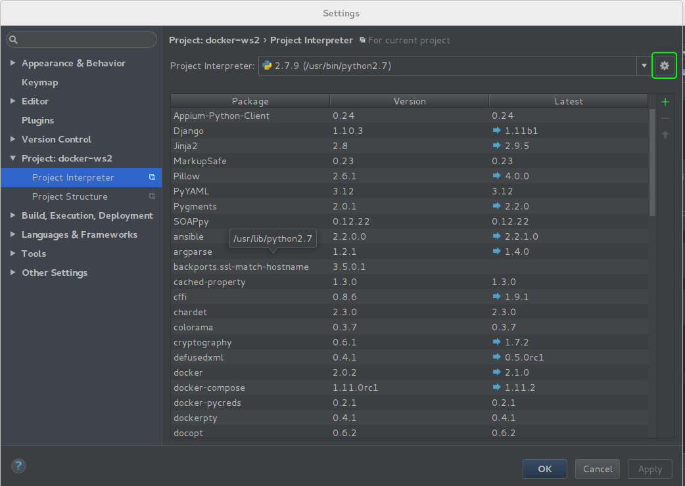
> Add remote

### Open deployment settings
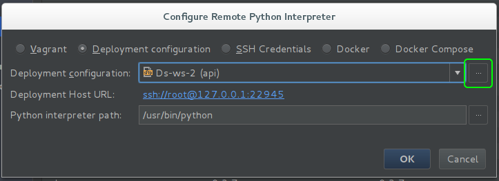

### Open Add server
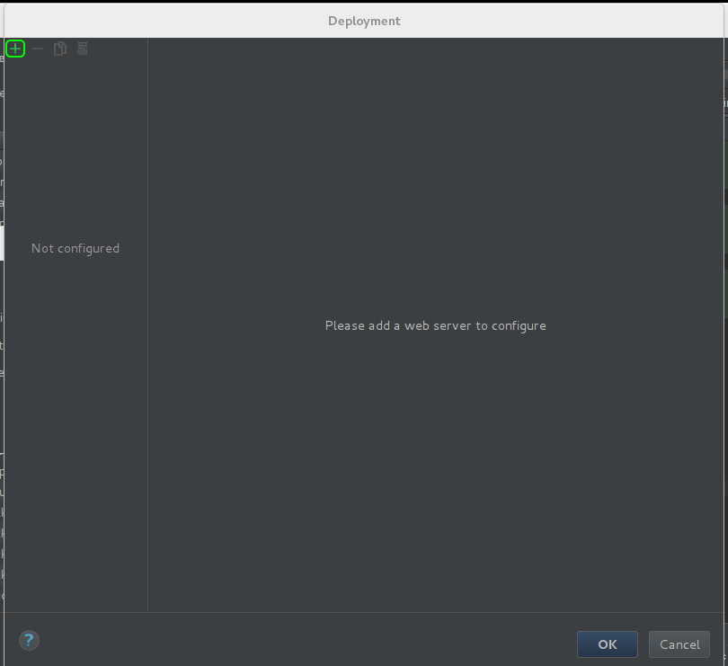

### Add new server
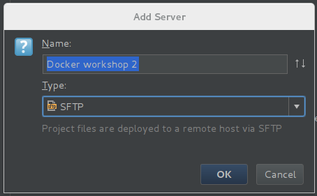

### Setup server


### Test sftp connection
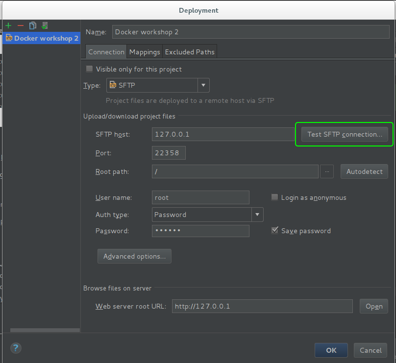

### Successfully connected to 127.0.0.1
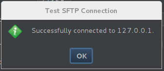

### Save deployment server
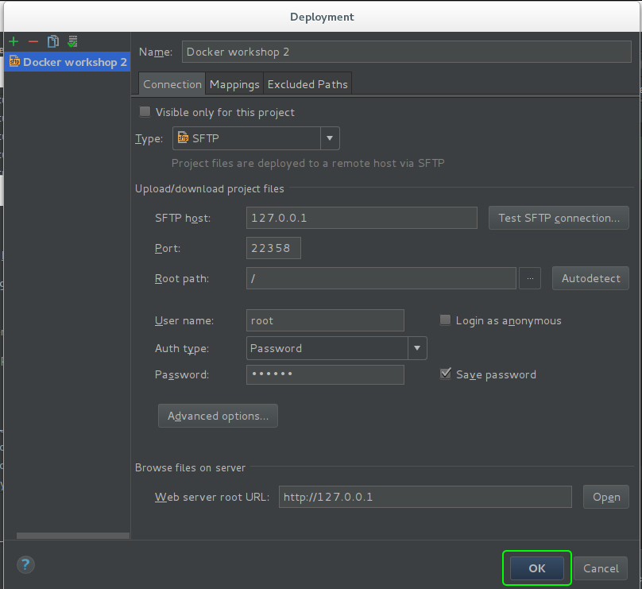

### Configure remote python interpreter
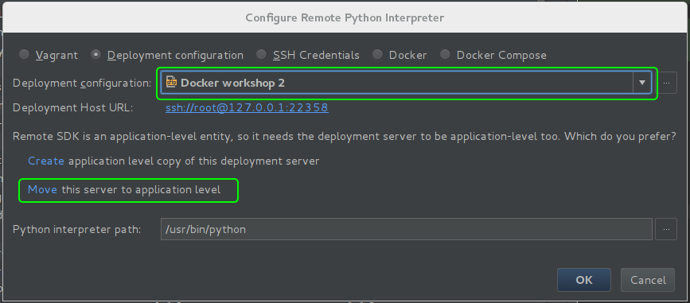
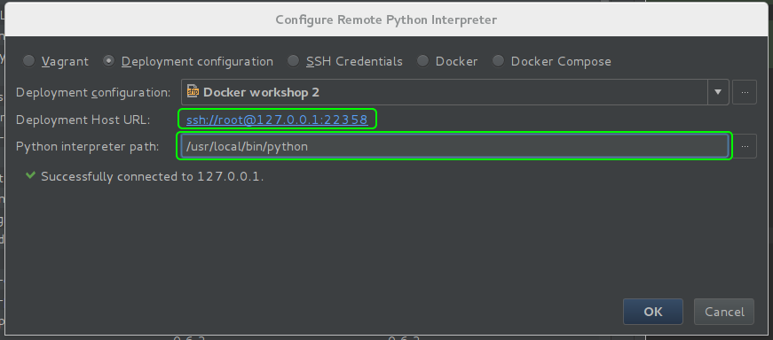
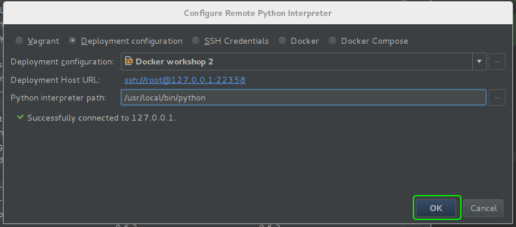

### Save settings project interpreter
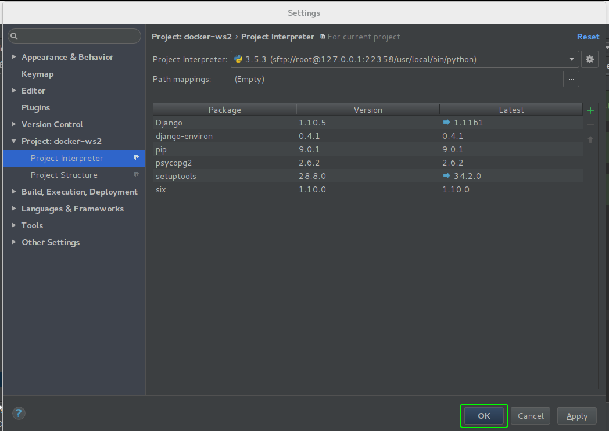

## 13. Add api for send email
### Added package djangorestframework
[Necessary changes](https://github.com/haos616/docker-workshop-2/commit/893e3dfeab563c75e40950880dd125ac78cddc46)

### Rebuild django image
```bash
$ docker-compose build django
```

### Add email api
[Necessary changes](https://github.com/haos616/docker-workshop-2/commit/7a016ff947f7a381cebee53d27a78cba241f0111)

### Check email api
> Go to `http://127.0.0.1:8000/api/v1/email`

### Add test for email api
[Necessary changes](https://github.com/haos616/docker-workshop-2/commit/302dd4b437bba5a03509ef48f74dafbb9b626bd2)

### Run django test
```bash
$ docker-compose run --rm django python manage.py test
Starting with UID : 1000
Postgres is unavailable - sleeping
/usr/local/lib/python3.5/site-packages/environ/environ.py:608: UserWarning: /code/ws2/.env doesn't exist - if you're not configuring your environment separately, create one.
  "environment separately, create one." % env_file)
/usr/local/lib/python3.5/site-packages/environ/environ.py:608: UserWarning: /code/ws2/.env doesn't exist - if you're not configuring your environment separately, create one.
  "environment separately, create one." % env_file)
Operations to perform:
  Apply all migrations: admin, auth, contenttypes, sessions
Running migrations:
  No migrations to apply.
/usr/local/lib/python3.5/site-packages/environ/environ.py:608: UserWarning: /code/ws2/.env doesn't exist - if you're not configuring your environment separately, create one.
  "environment separately, create one." % env_file)
Creating test database for alias 'default'...
.
----------------------------------------------------------------------
Ran 1 test in 0.031s

OK
Destroying test database for alias 'default'...
```

### Add pdb in test
[Necessary changes](https://github.com/haos616/docker-workshop-2/commit/a785c2ab5f82720f0a7b2395304f5c8431385017)

### Run django test with pdb
```bash
$ docker-compose run --rm django python manage.py test
Starting with UID : 1000
Postgres is unavailable - sleeping
/usr/local/lib/python3.5/site-packages/environ/environ.py:608: UserWarning: /code/ws2/.env doesn't exist - if you're not configuring your environment separately, create one.
  "environment separately, create one." % env_file)
/usr/local/lib/python3.5/site-packages/environ/environ.py:608: UserWarning: /code/ws2/.env doesn't exist - if you're not configuring your environment separately, create one.
  "environment separately, create one." % env_file)
Operations to perform:
  Apply all migrations: admin, auth, contenttypes, sessions
Running migrations:
  No migrations to apply.
/usr/local/lib/python3.5/site-packages/environ/environ.py:608: UserWarning: /code/ws2/.env doesn't exist - if you're not configuring your environment separately, create one.
  "environment separately, create one." % env_file)
Creating test database for alias 'default'...
> /code/core/tests.py(14)test_get_time()
-> response = self.client.get(url)
(Pdb) 
```

### Remove pdb
[Necessary changes](https://github.com/haos616/docker-workshop-2/commit/6bbbcddc7983aec47d6d21abbc03fa65943d603b)

## 14. Add Celery
### Add celery and celery task
[Necessary changes](https://github.com/haos616/docker-workshop-2/commit/385a65227af142e1c49b24baae6003f715cc52b2)

### Rebuild django image
```bash
$ docker-compose build django
```

### Call email api
> Go to `http://127.0.0.1:8000/api/v1/email`

### Connect to telnet
```bash
$ telnet 127.0.0.1 6901
Trying 127.0.0.1...
Connected to 127.0.0.1.
Escape character is '^]'.
> /code/core/tasks.py(11)email()
-> send_mail('Test subject', 'Test message', 'from@example.com', ['to@example.com'])
(Pdb)
```

## 15. Add mailhog
### Add mailhog service and change setting
[Necessary changes](https://github.com/haos616/docker-workshop-2/commit/6b1a84f43f544def604b1087a9b9a88f7ffd33b9)

### Run docker-compose
```bash
$ docker-compose up
Starting ws2_redis_1
Starting ws2_mailhog_1
Starting ws2_postgres_1
Recreating ws2_django_1
Recreating ws2_celery_worker_1
Recreating ws2_django_sshd_1
Attaching to ws2_mailhog_1, ws2_redis_1, ws2_postgres_1, ws2_celery_worker_1, ws2_django_1, ws2_django_sshd_1
```

### Check mailhog
> Go to `http://127.0.0.1:8025`


## 16. Add nginx
### Add nginx service
[Necessary changes](https://github.com/haos616/docker-workshop-2/commit/7ccbd66d215b5f5e86e946b28df8a84bcec66ac7)

### Rebuild nginx image
```bash
$ docker-compose build nginx
Building nginx
Step 1 : FROM nginx:1.11.10
 ---> db079554b4d2
Step 2 : RUN apt-get update     && apt-get install --no-install-recommends -y python python-pip     && rm -rf /var/lib/apt/lists/*     && pip install Jinja2
 ---> Using cache
 ---> b550de6adeda
Step 3 : ADD . /scripts
 ---> a337d7cf19e4
Removing intermediate container c7516c0b01a2
Step 4 : ENTRYPOINT /scripts/docker-entrypoint.sh
 ---> Running in 628760e4508c
 ---> 49b63cfc222c
Removing intermediate container 628760e4508c
Step 5 : CMD nginx -g daemon off;
 ---> Running in 357bf8dc0c1c
 ---> 7ce53981a62f
Removing intermediate container 357bf8dc0c1c
Successfully built 7ce53981a62f
```

### Run docker-compose
> Stop local nginx
```bash
$ docker-compose up
```

### Check nginx
> Go to `http://127.0.0.1`

## 17. Add frontend-skeleton
### Clone repo to site folder
```bash
$ git clone git@github.com:django-stars/frontend-skeleton.git site
```

### Remove folder .git
```bash
$ rm site/.git -rf
```

### Create site/local.json
```json
{
  "BACKEND_URL": "http://django:8000",
  "API_URL": "/api/v1/",
  "PROXIES": ["/s/", "/m/"],
  "STATIC_PATH": "static"
}
```

### Build site image
```bash
$ docker-compose build site
Building site
Step 1 : FROM node:6.9.5
 ---> cde8ba396275
Step 2 : RUN apt-get update     && apt-get install -y --no-install-recommends ruby-full     && rm -rf /var/lib/apt/lists/*     && gem install sass compass rubygems-update     && npm install -g gulp bower node-gyp
 ---> Using cache
 ---> db78cd96e982
Step 3 : ADD ./site/package.json /code/package.json
 ---> Using cache
 ---> 5e45bf969d82
Step 4 : WORKDIR /code
 ---> Using cache
 ---> 53bbc35865d1
Step 5 : RUN npm install
 ---> Using cache
 ---> 84016ee436af
Successfully built 84016ee436af
```

### Run docker-compose
```bash
$ docker-compose up
```

## Add site service
[Necessary changes](https://github.com/haos616/docker-workshop-2/commit/5a4e2f13875f70e661da890d305dbd785983bee0)

### Check site
> Go to `http://127.0.0.1:3000/`
